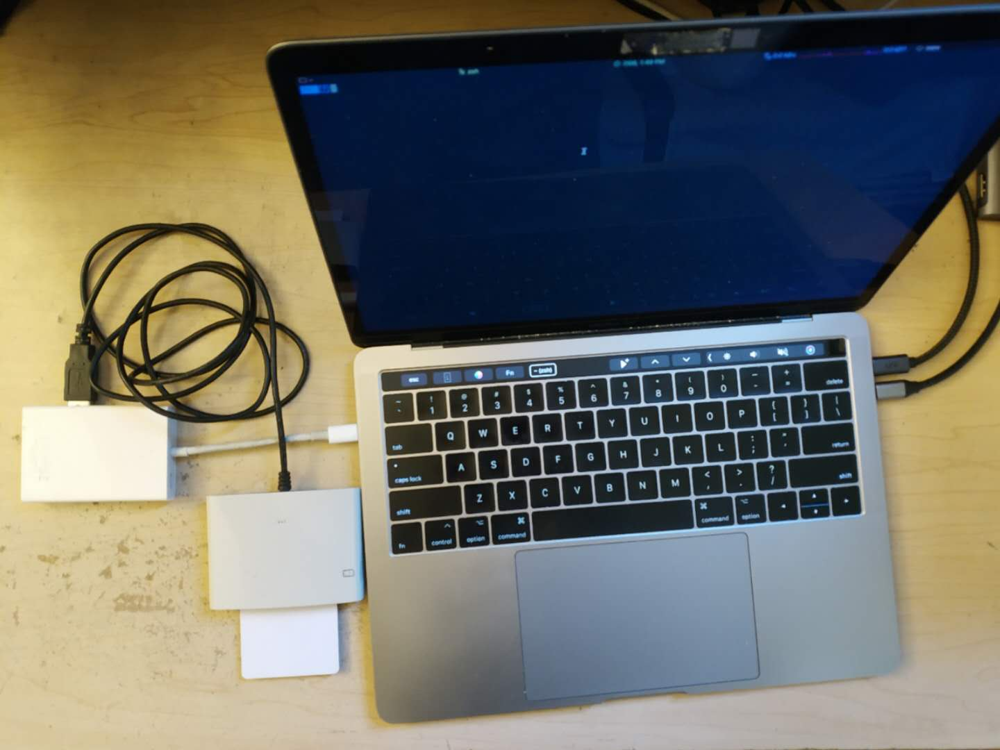

Profile Loader for Jcard-based SIM/eSIM
====================================================

A sim profile loader program that can be used to read/write all fields/parameters
on Jcard-based programmable SIM/eSIM [eSIM-Applet] based on Python 3. 

This project can be used to test your own cellular network with customized profile.

## Usage

### Javacard reader
The reader is needed for [eSIM-Applet] and [eSIM-Loader] to let you install the 
eSIM applet on the Jcard and load profiles into it.


### Install Dependencies 
- For Linux, you may need to install dependencies:
```$xslt
 sudo apt-get install pcscd pcsc-tools libccid libpcsclite-dev python-pyscard
```

- Install the required package by:

```$xslt
 pip install pyscard pytlv
```

### Load the profile into Javacard

`./profile-write.py` is used to build SIM structure on the Jcard. You can install the profile by:

```
  python profile-write.py --imsi 001010000099999 --opc 0102030405060708090A0B0C0D0E0F00 --key 0102030405060708090A0B0C0D0E0F01

```

The IMSI, OPC and KEY can be configured with --imsi, --opc and --key arguments:

All default values of other fields can be configured in the folder `profile` by replacing the
data in the corresponding .txt files. For example, if you want to change `EF_LI(6F05)` in ADF, 
you can replace the Data field in the `profile/adf.txt`:
```$xslt
Name: 6F05 //EF_LI
 Type: transparent 
 FCI: 62258202412183026f05a50cc001009b043f002f05ca01808a01058b036f06028002000a880110 
 Data: ffffffffffffffffffff //Replace the fefault 'ff..ff' with your value
```

### Read the current profile from Javacard 

After installing the profile, profile-read can extract current EF fields from Javacard SIM. 
By default, the profile will be exported to `./profile-read`:
```
 python ./profile-read.py
```

[eSIM-WING]: https://github.com/JinghaoZhao/eSIM-WING
[eSIM-Loader]: https://github.com/JinghaoZhao/eSIM-Loader
[eSIM-Applet]: https://github.com/Project-Flora/Flora-eSIM
[WING-SMDP]: https://github.com/JinghaoZhao/WING-SMDP
[LPA-App]: https://github.com/JinghaoZhao/LPA-App


## Citation
If you find this repo useful, please cite our paper.
```
@inproceedings{zhao2021securesim,
  title={SecureSIM: rethinking authentication and access control for SIM/eSIM},
  author={Zhao, Jinghao and Ding, Boyan and Guo, Yunqi and Tan, Zhaowei and Lu, Songwu},
  booktitle={Proceedings of the 27th Annual International Conference on Mobile Computing and Networking},
  pages={451--464},
  year={2021}
}
```
